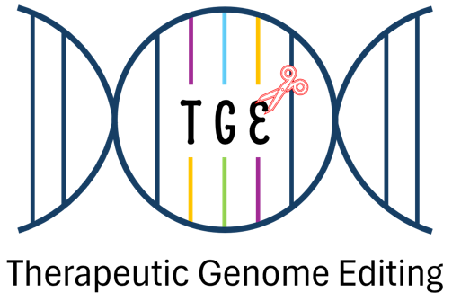

```{r setup, include=FALSE}
knitr::opts_chunk$set(echo = TRUE,cache = F)
options(verbose = F)
options(knitr.kable.NA = '')
```

```{r,error=F,message=FALSE,warning=FALSE,echo=FALSE}
# Libraries

library(tidyverse,quietly = T,warn.conflicts = F,verbose = F)
library(kableExtra,quietly = T,warn.conflicts = F,verbose = F)
library(yaml,quietly = T,warn.conflicts = F,verbose = F)
library(UpSetR)

libraries_count <- length(summary_pred_bulge)

```

::: {style="align-items: center;"}
{style="border-radius:5px;margin-left: auto;   margin-right: auto;justify-content: center;" width="150"}
:::

The GUIDE-Seq (Genome-wide Unbiased Identification of Double-strand breaks Enabled by Sequencing) method enables comprehensive detection and quantification of off-target activity by capturing double-strand breaks across the genome through oligonucleotide tagging, followed by sequencing and bioinformatic analysis.

------------------------------------------------------------------------

Working directory : **`r dirname(config_path)`**

Pipeline version: **`r config$version`**

The analysis was performed **`r ifelse(config$tolerate_bulges==TRUE, "with","without")`** bulge tolerance.

All parameters can be found in [Configuration settings] at the end of this document.

------------------------------------------------------------------------

# Description of libraries

```{r,echo=F}
collapse_rows(kbl(sampleInfo %>% 
      arrange(sampleName) %>% 
      select(library=sampleName,
             replicate,
             "Cells"=Cell_Type, 
             Genome,"gRNA"=gRNA_name,
             "gRNA sequence"=gRNA_sequence, 
             "PAM"=PAM_sequence,
             Cas,
             type,
             orientation) %>% 
      select(
    where(
      ~sum(!is.na(.x)) > 0
    )),
                      caption = "Table 1") %>%
        kable_classic_2(full_width = T,html_font = "helvetica") %>% 
        kable_styling(bootstrap_options = c("condensed","hover","stripped"),
                      font_size = 11,
                      fixed_thead = T))
```

# Statistics of reads processing

```{r,echo=F}

kbl(stats%>% 
      arrange(library),
    caption = "Table 2") %>%
  kable_classic_2(full_width = T,html_font = "helvetica") %>%
  kable_styling(bootstrap_options = c("condensed","hover","stripped"),
                font_size = 12,
                fixed_thead = T)
```

> Read-pairs with length greater than **`r config$minLength`** bp (both of the pair) were considered for analysis.
>
> All percentages represents % of demultiplexed reads

# Reads alignment, cut sites calling and clustering

Summary of the alignment step, calling step and clustering of cutting sites including :

-   The number of reads aligned on the genome

-   The number of UMIs detected (estimation of total number of events)

-   The number of unique ODN insertion sites

-   The number of clusters.

```{r,echo=F,warning=FALSE, message=FALSE,error=FALSE}

alignment_table <- lapply(tables_off,data.frame) %>%   
  bind_rows(.id="library")  
names(alignment_table) <- c('library','link') 

kbl(stats_summary %>%
      arrange(library) %>%
      left_join(alignment_table,by="library") %>%
      mutate(`With gRNA match ..` = cell_spec(`With gRNA match ..`, "html", 
                                        new_tab=T,
                                        link = paste("./report-files/",basename(link),sep = ""))) %>%
      select(-link),
    escape = F,
    caption = "Table 3",
    format.args = list(big.mark = ","),
    align=c("r","r","r","r","r","c","l","r" ))%>% 
  kable_classic_2(full_width = T,html_font = "helvetica") %>%
  add_header_above(c(" " = 4, "Clusters count" = 4)) %>%  
  kable_styling(bootstrap_options = c("condensed","hover","stripped"),                 font_size = 12,
                fixed_thead = T) %>%
  collapse_rows(columns = c(1:6),target = 1) 
```

> Cut sites were identified from the alignment start position of R2 reads.
>
> -   Reads were aggregated if they share the exact same start position and the same UMI sequence.
>
> -   UMI were corrected using the **`r config$UMI_deduplication`** method with a Hamming distance tolerance of **`r config$UMI_hamming_distance`**.
>
> -   Positions/UMI with more than **`r config$minReadsPerUMI`** reads were considered for next step.
>
> Clusters are defined as a group of ODN insertion sites within a distance smaller than **`r config$ISbinWindow`** bp and characterized by :
>
> -   Presence of reads aligning in both directions, indicating both ODN orientations ("dual Orientation" in table below)
>
> -   Presence of multiple insertion sites positions ("multiple Cuts" in table below)
>
> -   Match of the crRNA sequence with less than **`r config$max_edits_crRNA`** edits withing the cluster boundaries +/- **`r config$slopSize`** bp ("crRNA matched" in table below)
>
> Clusters with more than **`r config$minUMIPerIS`** total UMIs were considered.

# Best match(es)

For each library, the best match(es) are clusters with the minimal number of edits in the gRNA and PAM sequences ( which may not necessarily be 0 ).

```{r,echo=F}
kbl(best_aligns %>% 
      arrange(library) %>% 
      mutate("Cut offset" = as.numeric(cut_modal_position) - as.numeric(cut_gRNa_alignment),.after = chromosome) %>% 
      select(-clusterID,-cut_modal_position) %>% 
      unite("Position",chromosome,cut_gRNa_alignment,sep=":"),
                      caption = "Table 4",
    format.args = list(big.mark = ",")) %>%
        kable_classic_2(full_width = T,html_font = "helvetica") %>% 
        kable_styling(bootstrap_options = c("condensed","hover","stripped"),
                      font_size = 12,
                      fixed_thead = T) %>%
  collapse_rows(columns = 1, valign = "middle")
```

> -   "Position" : Theoretical cutting site based on gRNA alignment to gDNA and nuclease offset.
>
> -   "Cut offset" : Difference between theoretical cutting site and most frequent cutting site in the cluster.
>
> -   Edits\* : Number of INDEL+mismatches
>
> -   "Relative Abundance" : Contribution of cluster abundance in % of total UMIs count. Only clusters with gRNA match with ≤ **`r config$max_edits_crRNA`** edits and ≥ **`r config$minUMIPerIS`** UMIs are considered.
>
> -   Rank: Rank of the best candidate(s) based on UMI count.

## Rank-abundance curve

The rank-abundance curve provides insights into relative cluster abundance - a steep curve indicates dominance by a few clusters, while a shallow curve suggests more even distribution among different clusters.

```{r,fig.width=12, fig.height=ceiling(libraries_count/3)*3,fig.align='center',fig.format='png', echo=FALSE,collapse=TRUE, fig.cap="Figure 1"}

fig_RankAbundance
```

> -   Only clusters with gRNA match and more than **`r config$minUMI_alignments_figure`** total UMIs are plotted.
>
> -   `Red` dots correspond to clusters with `minimal edits` (see table 4).
>
> -   Top3 most abundant clusters (UMI counts) are labeled.

## Distribution of cut sites around best candidates position

For each best candidate cluster, plot the UMI count detected around the gRNA theoretical cut site (dashed line) for each cut site, in the forward or reverse ODN orientation (blue and red bars respectively).

```{r, fig.width=12, fig.height=ceiling(nrow(best_aligns)/3)*2, fig.align='center', fig.format='png', echo=FALSE, fig.cap= "Figure 2"}

fig_distrAroundBestSite
```

# Genome distribution of clusters

This figure represents the distribution of unique clusters `with gRNA` match per chromosome, colored by `prediction` status. Only clusters with number of edits (INDELs and substitutions) smaller or equal to **`r config$max_edits_crRNA`** are considered.

```{r,fig.width=12, fig.height=ceiling(libraries_count/3)*4,fig.align='center',fig.format='png', echo=FALSE, fig.cap= "figure 3"}
fig_ChromDistr_clusters
```

This figure represents the total number of UMIs (cells) per chromosome from clusters with gRNA match, colored by `prediction` status. Only clusters with number of edits (INDELs and substitutions) smaller or equal to **`r config$max_edits_crRNA`** are considered.

```{r,fig.width=12, fig.height=ceiling(libraries_count/3)*4,fig.align='center',fig.format='png', echo=FALSE, fig.cap= "figure 4"}
fig_ChromDistr_UMI
```

# Configuration settings

``` yaml
`r xfun::file_string(config_path)`
```

# R session informations

```{r,echo=FALSE}
sessionInfo()
```
